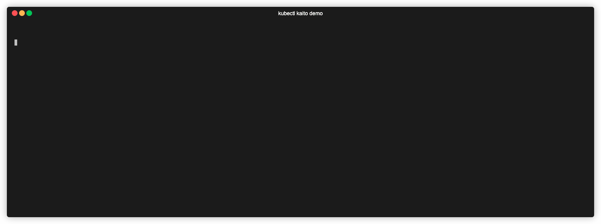

# kaito-kubectl-plugin

[](https://opensource.org/licenses/Apache-2.0)

A kubectl plugin for deploying and managing AI/ML models using the [Kubernetes AI Toolchain Operator (Kaito)](https://github.com/kaito-project/kaito).

## Overview

kubectl-kaito simplifies AI model deployment on Kubernetes by providing an intuitive command-line interface that abstracts away complex YAML configurations. Deploy, manage, and interact with large language models and other AI workloads with simple commands.

## Features



- **One-command deployment** Deploy AI models with a single command that automatically provisions GPU nodes and configures the inference stack
- **Real-time monitoring** Monitor workspace deployment status with real-time conditions, NodeClaim tracking, and detailed health checks
- **OpenAI-compatible APIs** Interact with deployed models through an OpenAI-compatible chat interface with customizable system prompts
- **Model discovery** Browse and discover Kaito pre-configured AI models with detailed specifications and GPU requirements
- **Seamless endpoint access** Access inference endpoints automatically using Kubernetes API proxy - works anywhere kubectl works without manual setup

## Quick Start

```bash
# List available models
kubectl kaito models list

# Deploy a model for inference
kubectl kaito deploy --workspace-name my-workspace --model llama-2-7b

# Check deployment status
kubectl kaito status --workspace-name my-workspace

# Get inference endpoint
kubectl kaito get-endpoint --workspace-name my-workspace

# Start interactive chat
kubectl kaito chat --workspace-name my-workspace
```

## Installation

### Prerequisites

- Kubernetes cluster with GPU nodes
- [Kaito operator](https://github.com/kaito-project/kaito) installed in your cluster
- kubectl configured to access your cluster

### Install via Krew

> **Prerequisites**: Install [krew](https://krew.sigs.k8s.io/docs/user-guide/setup/install/) if you haven't already.

#### From Krew Index (Coming Soon)

```bash
kubectl krew install kaito
```

#### Install from Local Manifest

```bash
# Clone the repository
git clone https://github.com/kaito-project/kaito-kubectl-plugin.git
cd kaito-kubectl-plugin

# Generate manifest for a specific version
./hack/generate-krew-manifest.sh v0.1.0

# Install the generated manifest
kubectl krew install --manifest=krew/kaito-v0.1.0.yaml
```

#### Install from URL

```bash
# Install a specific version from GitHub
kubectl krew install --manifest=https://github.com/kaito-project/kaito-kubectl-plugin/releases/download/v1.0.0/kaito.yaml
```

#### Generate Krew Manifest Locally

For development and testing:

```bash
# Generate complete manifest with real SHA256 values
./hack/generate-krew-manifest.sh v1.0.0
```

### Manual Installation

#### Download Pre-built Binary

1. Download the latest binary from the [releases page](https://github.com/kaito-project/kaito-kubectl-plugin/releases)
2. Extract and place the binary in your `$PATH` as `kubectl-kaito`
3. Make it executable:

   ```bash
   chmod +x kubectl-kaito
   ```

#### Build from Source

```bash
git clone https://github.com/kaito-project/kaito-kubectl-plugin.git
cd kaito-kubectl-plugin
make build
sudo mv bin/kubectl-kaito /usr/local/bin/
```

### Verify Installation

```bash
# Check if the plugin is installed
kubectl plugin list | grep kaito

# Test basic functionality
kubectl kaito --help
kubectl kaito models list
```

## Usage Examples

### Basic Model Deployment

```bash
# Deploy Phi-3.5 Mini for general inference
kubectl kaito deploy \
  --workspace-name phi-workspace \
  --model phi-3.5-mini-instruct \
  --instance-type Standard_NC6s_v3

# Monitor deployment
kubectl kaito status --workspace-name phi-workspace --watch

# Test the deployment
kubectl kaito chat --workspace-name phi-workspace
```

### Fine-tuning Workflow

```bash
# Fine-tune a model with your data
kubectl kaito deploy \
  --workspace-name tune-phi \
  --model phi-3.5-mini-instruct \
  --tuning \
  --tuning-method qlora \
  --input-urls "https://example.com/training-data.parquet" \
  --output-image "myregistry.azurecr.io/phi-tuned:v1" \
  --output-image-secret my-registry-secret

# Deploy the fine-tuned model
kubectl kaito deploy \
  --workspace-name phi-tuned \
  --model phi-3.5-mini-instruct \
  --adapters phi-adapter="myregistry.azurecr.io/phi-tuned:v1"
```

### Multi-GPU Large Model Deployment

```bash
# Deploy Llama-2 70B across multiple nodes
kubectl create secret generic hf-token --from-literal=token=your_token

kubectl kaito deploy \
  --workspace-name large-llama \
  --model llama-2-70b \
  --model-access-secret hf-token \
  --instance-type Standard_NC24ads_A100_v4 \
  --count 4
```

## Commands

| Command                                  | Description                                                 |
| ---------------------------------------- | ----------------------------------------------------------- |
| [`deploy`](./docs/deploy.md)             | Deploy a Kaito workspace for model inference or fine-tuning |
| [`status`](./docs/status.md)             | Check status of Kaito workspaces                            |
| [`get-endpoint`](./docs/get-endpoint.md) | Get inference endpoints for a workspace                     |
| [`chat`](./docs/chat.md)                 | Interactive chat with deployed AI models                    |
| [`models`](./docs/models.md)             | Manage and list supported AI models                         |

## Documentation

📖 **[Complete Documentation](./docs/README.md)**

## Development

### Build from Source

```bash
# Clone the repository
git clone https://github.com/kaito-project/kaito-kubectl-plugin.git
cd kaito-kubectl-plugin

# Build the plugin
make build
```

## License

This project is licensed under the Apache License 2.0 - see the [LICENSE](LICENSE) file for details.
